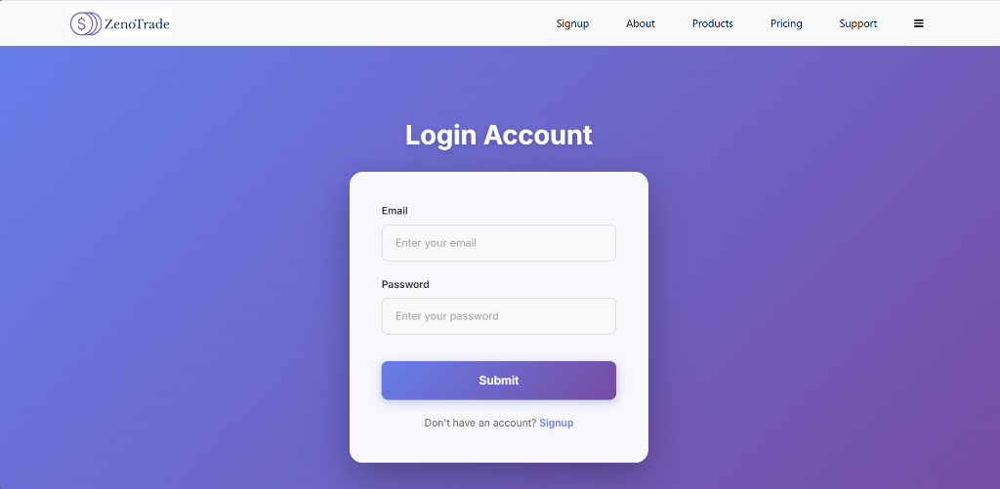
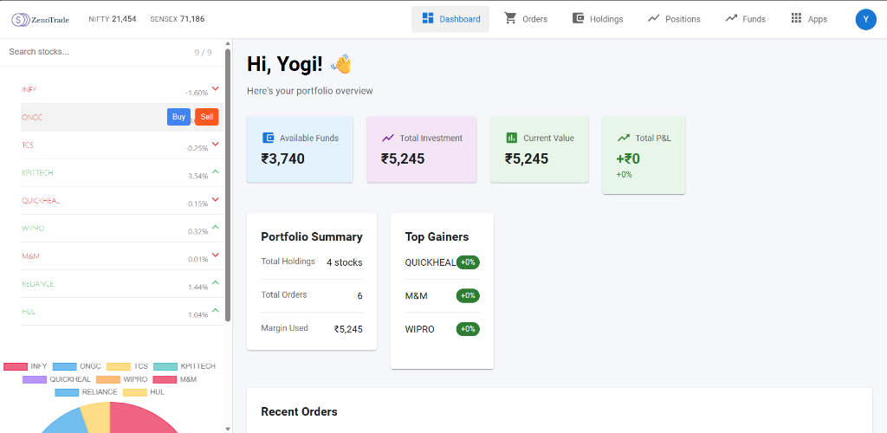
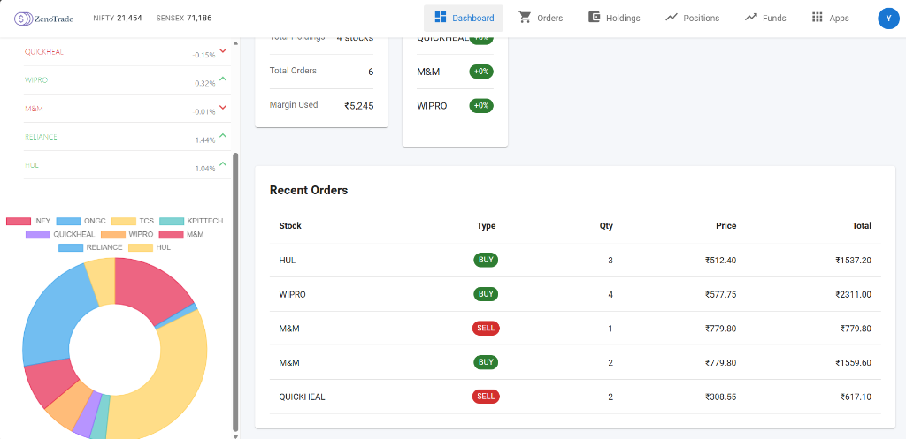

# 📈 ZenoTrade - Stock Trading Platform

A full-stack stock trading platform built with the MERN stack (MongoDB, Express, React, Node.js). ZenoTrade provides a comprehensive trading experience with real-time portfolio management, order tracking, and market analysis.


## 📸 Screenshots

### Login Page


### Dashboard Overview


### Portfolio View


## 🎯 Demo Account - Quick Start

> **🚀 Want to try ZenoTrade immediately with pre-populated data?**

### Demo Credentials for deployement link only
```
Email: yo@gmail.com
Password: 123
```

**What's included in the demo account:**
- ✅ Sample holdings with real profit/loss calculations
- ✅ Complete order history (buy & sell orders)
- ✅ Active positions with P&L tracking
- ✅ Portfolio distribution charts
- ✅ All features pre-configured and ready to explore

**Note:** You can also create your own account, but the demo account provides immediate access to all features with realistic sample data.

## 🌟 Features

### 📊 Dashboard
- **Real-time Portfolio Overview** - Track your investments with live P&L calculations
- **Market Indices** - Live NIFTY and SENSEX updates
- **Quick Stats Cards** - Available funds, total investment, current value, and total P&L
- **Top Gainers** - See your best performing stocks
- **Recent Activity** - Last 5 orders at a glance

### 💼 Holdings
- **Net Position Tracking** - Calculated from BUY - SELL orders
- **Real-time P&L** - Profit/loss with percentage
- **Last Action Indicator** - Shows whether your last transaction was BUY or SELL
- **Portfolio Distribution Chart** - Visual representation of your holdings
- **Summary Cards** - Total investment, current value, and overall P&L

### 📋 Orders
- **Complete Order History** - All your buy and sell transactions
- **Filter by Type** - View all, buy only, or sell only orders
- **Date & Time Stamps** - Track when each order was placed
- **Order Details** - Quantity, price, total value, order type, and product type
- **Summary Statistics** - Total buy/sell orders and net position

### 📍 Positions
- **Intraday Positions** - Today's open positions only
- **Unrealized P&L** - Real-time profit/loss on open positions
- **Exit Functionality** - Quick exit button to close positions
- **Position Summary** - Total invested, current value, and unrealized P&L

### 💰 Funds
- **Available Margin** - See how much you can invest
- **Used Margin** - Track your deployed capital
- **Account Details** - Opening balance, payin, payout, and more
- **Dynamic Calculations** - Real-time margin updates based on positions

### 📱 WatchList
- **Stock Search** - Real-time search functionality
- **Color-coded Chart** - Visual portfolio distribution
- **Quick Actions** - Buy/Sell buttons on hover
- **Price Tracking** - Live price updates with profit/loss indicators

### 🔐 Authentication
- **Secure Signup/Login** - JWT-based authentication
- **Session Management** - Persistent login with cookies
- **User Profile** - Display name and email management

## 🚀 Quick Start

### Prerequisites
- Node.js (v14 or higher)
- MongoDB (local or Atlas)
- npm or yarn

### Installation

1. **Clone the repository**
```bash
git clone https://github.com/Yogiraj2005/ZenoTrade--Stock-Trading-platform.git
cd ZenoTrade--Stock-Trading-platform
```

2. **Install dependencies for all three applications**

```bash
# Install frontend dependencies
cd frontend
npm install

# Install backend dependencies
cd ../backend
npm install

# Install dashboard dependencies
cd ../dashboard
npm install
```

3. **Configure Environment Variables**

Create a `.env` file in the `backend` directory:

```env
MONGO_URL=your_mongodb_connection_string
TOKEN_KEY=your_secret_jwt_key
PORT=3002
```

4. **Start the applications**

Open **three separate terminals**:

**Terminal 1 - Backend:**
```bash
cd backend
npm start
```

**Terminal 2 - Frontend (Landing Page):**
```bash
cd frontend
npm start
```

**Terminal 3 - Dashboard:**
```bash
cd dashboard
npm start
```

5. **Access the application**
- Frontend (Landing): `http://localhost:3000`
- Dashboard: `http://localhost:3001`
- Backend API: `http://localhost:3002`

## 📁 Project Structure

```
ZenoTrade--Stock-Trading-platform/
├── frontend/                 # Landing page (React)
│   ├── src/
│   │   ├── landing_page/
│   │   │   ├── home/        # Homepage components
│   │   │   ├── login/       # Login page
│   │   │   └── signup/      # Signup page
│   │   └── ...
│   └── package.json
│
├── dashboard/               # Trading dashboard (React)
│   ├── src/
│   │   ├── components/
│   │   │   ├── Dashboard.js    # Main dashboard
│   │   │   ├── Holdings.js     # Holdings component
│   │   │   ├── Orders.js       # Orders component
│   │   │   ├── Positions.js    # Positions component
│   │   │   ├── Funds.js        # Funds component
│   │   │   ├── WatchList.js    # WatchList component
│   │   │   ├── Summary.js      # Summary/Overview
│   │   │   └── ...
│   │   └── ...
│   └── package.json
│
└── backend/                 # Node.js + Express API
    ├── controllers/
    │   └── AuthController.js   # Authentication logic
    ├── model/
    │   ├── UserModel.js        # User schema
    │   ├── OrdersModel.js      # Orders schema
    │   ├── HoldingsModel.js    # Holdings schema
    │   └── PositionsModel.js   # Positions schema
    ├── Routes/
    │   └── AuthRoute.js        # Auth routes
    ├── middlewares/
    │   └── AuthMiddleware.js   # JWT verification
    └── index.js                # Main server file
```

## 🛠️ Tech Stack

### Frontend
- **React** - UI library
- **React Router** - Navigation
- **Material-UI** - Component library
- **Axios** - HTTP client
- **Chart.js** - Data visualization
- **React Hot Toast** - Notifications

### Backend
- **Node.js** - Runtime environment
- **Express** - Web framework
- **MongoDB** - Database
- **Mongoose** - ODM
- **JWT** - Authentication
- **bcryptjs** - Password hashing
- **cookie-parser** - Cookie handling
- **CORS** - Cross-origin requests

## 🔑 Key Features Explained

### Order Management System
- **BUY Orders** - Create buy orders with quantity and price
- **SELL Orders** - Sell existing holdings (partial or full)
- **Order Tracking** - Complete history with timestamps
- **Net Position Calculation** - Holdings = Total BUY - Total SELL

### Real-time P&L Calculation
```javascript
Current Value = Quantity × Current Price
Invested Value = Quantity × Average Buy Price
Profit/Loss = Current Value - Invested Value
P&L % = (Profit/Loss / Invested Value) × 100
```

### Authentication Flow
1. User signs up with email, username, and password
2. Password is hashed using bcrypt (12 rounds)
3. JWT token is generated and stored in cookie
4. Token is verified on each protected route
5. User ID is extracted from token for data filtering

## 📊 API Endpoints

### Authentication
- `POST /signup` - Create new user account
- `POST /login` - Login existing user
- `POST /` - Verify user token

### Orders
- `GET /allOrders` - Get user's orders
- `POST /newOrder` - Create new order
- `POST /sellOrder` - Create sell order

### Holdings & Positions
- `GET /allHoldings` - Get user's holdings
- `GET /allPositions` - Get user's positions

## 🎨 UI/UX Highlights

- **Modern Material-UI Design** - Clean, professional interface
- **Responsive Layout** - Works on all screen sizes
- **Color-coded Indicators** - Green for profit, red for loss
- **Interactive Charts** - Doughnut charts for portfolio visualization
- **Hover Actions** - Quick buy/sell on watchlist items
- **Search Functionality** - Real-time stock search
- **Loading States** - Smooth loading indicators
- **Empty States** - Helpful messages when no data

## 🔒 Security Features

- JWT-based authentication
- HTTP-only cookies (can be configured)
- Password hashing with bcrypt
- CORS protection
- Input validation
- User-specific data isolation

## 🐛 Known Issues & Solutions

### Issue: Signup button not working
**Solution:** Fixed - Removed anchor tag from submit button

### Issue: Chart showing only red color
**Solution:** Fixed - Implemented dynamic color assignment based on stock index

### Issue: Search not filtering chart
**Solution:** Fixed - Chart now updates based on filtered stocks

## 🚧 Future Enhancements

- [ ] Real-time stock price updates via WebSocket
- [ ] Advanced charting with technical indicators
- [ ] Portfolio analytics and insights
- [ ] Mobile app (React Native)
- [ ] Paper trading mode
- [ ] News integration
- [ ] Alerts and notifications
- [ ] Multi-currency support

## 🤝 Contributing

Contributions are welcome! Please feel free to submit a Pull Request.

1. Fork the project
2. Create your feature branch (`git checkout -b feature/AmazingFeature`)
3. Commit your changes (`git commit -m 'Add some AmazingFeature'`)
4. Push to the branch (`git push origin feature/AmazingFeature`)
5. Open a Pull Request


## 👨‍💻 Author

**Nipun Bhadane**
- GitHub: ([@nipunbhadane123](https://github.com/nipunbhadane123))
- LinkedIn: [View Profile](https://www.linkedin.com/in/nipun-bhadane-4370802b6/)
- Email: [nipunbhadane3@gmail.com](mailto:nipunbhadane3@gmail.com)


**Yogiraj Shinde**
- GitHub: [@Yogiraj2005](https://github.com/Yogiraj2005)
- LinkedIn: [Yogiraj Shinde](https://www.linkedin.com/in/yogiraj-shinde-155354295/)
- Email: [yogirajshinde357@gmail.com](mailto:yogirajshinde357@gmail.com)

## 🙏 Acknowledgments

- Material-UI for the component library
- Chart.js for data visualization
- MongoDB for the database
- All contributors and supporters


